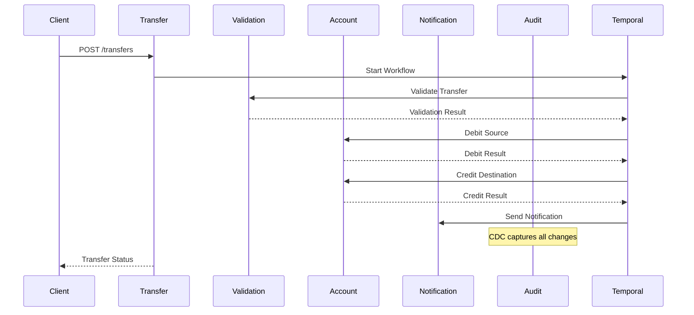

# Banking Demo with Temporal.io

Um sistema bancário completo demonstrando o uso do Temporal.io para orquestração de transferências monetárias com múltiplos microserviços, implementando padrões de saga distribuída, CDC (Change Data Capture) e auditoria completa.

## 🏗️ Arquitetura do Sistema

### Microserviços

| Serviço | Porta | Responsabilidade |
|---------|-------|------------------|
| **Account Service** | 8081 | Gerenciamento de contas bancárias e operações de saldo |
| **Transfer Service** | 8082 | Orquestração de transferências usando workflows Temporal |
| **Validation Service** | 8087 | Validação de transferências e detecção de fraudes |
| **Notification Service** | 8086 | Notificações de status via eventos Kafka |
| **Audit Service** | 8085 | Trilha de auditoria completa via CDC |

### Infraestrutura

| Componente | Porta | Descrição |
|------------|-------|-----------|
| **PostgreSQL (Main)** | 5432 | Banco principal (banking_demo) |
| **PostgreSQL (Audit)** | 5433 | Banco de auditoria (audit_db) |
| **Temporal Server** | 7233 | Motor de workflows |
| **Temporal UI** | 8088 | Interface web do Temporal |
| **Kafka** | 9092 | Message broker |
| **Kafka UI** | 8090 | Interface web do Kafka |
| **Debezium Connect** | 8083 | CDC connector |
| **Zookeeper** | 2181 | Coordenação do Kafka |

## 🚀 Instalação e Configuração

### Pré-requisitos

- **Java 21+**
- **Maven 3.8+**
- **Docker & Docker Compose**
- **Git**
- **Make** (opcional, mas recomendado)

### ⚡ Setup Rápido com Makefile

```bash
# Clone o repositório
git clone <repository-url>
cd banking-demo

# Setup completo em um comando
make setup

# Ou para desenvolvimento
make -f Makefile.dev dev-setup
```

### 📋 Comandos Principais

```bash
# Ver todos os comandos disponíveis
make help

# Setup e inicialização
make setup              # Setup completo
make setup-infra        # Apenas infraestrutura
make setup-cdc          # Apenas CDC

# Build e execução
make build-all          # Compila todos os serviços
make run-service SERVICE=account-service  # Executa um serviço

# Testes
make test-all           # Todos os testes
make test-transfer      # Teste de transferência
make test-cdc           # Teste do CDC

# Debug e diagnóstico
make debug-all          # Diagnóstico completo
make debug-cdc          # Debug do CDC
make debug-temporal     # Debug do Temporal

# Correções e Reset
make restart-all        # Reinicia toda infraestrutura
make reset-cdc          # Reset do CDC
make reset-temporal     # Reset workflows

# Limpeza
make clean              # Limpeza completa
make stop               # Para serviços
```

### 🛠️ Desenvolvimento com Makefile.dev

```bash
# Setup de desenvolvimento
make -f Makefile.dev dev-setup

# Reinicialização completa para desenvolvimento
make -f Makefile.dev dev-restart-all

# Iniciar todos os serviços em background
make -f Makefile.dev dev-start

# Reiniciar um serviço específico
make -f Makefile.dev dev-restart SERVICE=account-service

# Ver logs e debug
make -f Makefile.dev dev-logs SERVICE=account-service
make -f Makefile.dev dev-tail-logs
make -f Makefile.dev dev-health-check
make -f Makefile.dev dev-check-errors

# Testes de desenvolvimento
make -f Makefile.dev dev-test-flow

# Parar serviços
make -f Makefile.dev dev-stop
```

### 🔧 Setup Manual (sem Makefile)

<details>
<summary>Clique para ver instruções manuais</summary>

#### 1. Inicie a Infraestrutura

```bash
docker-compose -f docker-compose-banking.yml up -d
```

#### 2. Configure o CDC

```bash
# Aguarde 30 segundos para os serviços iniciarem
sleep 30

# Configure publicação PostgreSQL
docker exec banking-postgres psql -U postgres -d banking_demo -c "
CREATE PUBLICATION dbz_publication FOR TABLE public.accounts, public.transfers;"

# Registre conector Debezium
curl -X POST http://localhost:8083/connectors -H "Content-Type: application/json" -d '{
  "name": "banking-connector",
  "config": {
    "connector.class": "io.debezium.connector.postgresql.PostgresConnector",
    "database.hostname": "postgres",
    "database.port": "5432",
    "database.user": "postgres",
    "database.password": "postgres",
    "database.dbname": "banking_demo",
    "topic.prefix": "banking",
    "table.include.list": "public.accounts,public.transfers",
    "plugin.name": "pgoutput",
    "publication.name": "dbz_publication",
    "slot.name": "dbz_slot",
    "key.converter": "org.apache.kafka.connect.json.JsonConverter",
    "value.converter": "org.apache.kafka.connect.json.JsonConverter",
    "key.converter.schemas.enable": "false",
    "value.converter.schemas.enable": "false",
    "snapshot.mode": "initial"
  }
}'
```

#### 3. Compile e Execute

```bash
# Compile
./mvnw clean package -DskipTests

# Execute cada serviço em terminal separado
java -jar account-service/target/account-service-1.0-SNAPSHOT.jar
java -jar transfer-service/target/transfer-service-1.0-SNAPSHOT.jar
java -jar validation-service/target/validation-service-1.0-SNAPSHOT.jar
java -jar notification-service/target/notification-service-1.0-SNAPSHOT.jar
java -jar audit-service/target/audit-service-1.0-SNAPSHOT.jar
```

</details>

## 🔧 Verificação da Instalação

### Verificar Serviços

```bash
# Diagnóstico completo do CDC
./scripts/diagnose-cdc.sh

# Teste completo do sistema
./scripts/test-audit-cdc.sh
```

### Health Checks

```bash
# Verificar todos os serviços
curl http://localhost:8081/actuator/health  # Account Service
curl http://localhost:8082/actuator/health  # Transfer Service
curl http://localhost:8087/actuator/health  # Validation Service
curl http://localhost:8086/actuator/health  # Notification Service
curl http://localhost:8085/actuator/health  # Audit Service
```

### Interfaces Web

- **Temporal UI**: http://localhost:8088
- **Kafka UI**: http://localhost:8090

## 📋 Uso da API

### 1. Criar Contas

```bash
# Conta origem
curl -X POST http://localhost:8081/api/accounts \
  -H "Content-Type: application/json" \
  -d '{
    "accountNumber": "123456",
    "ownerName": "João Silva",
    "balance": 1000.00,
    "currency": "BRL"
  }'

# Conta destino
curl -X POST http://localhost:8081/api/accounts \
  -H "Content-Type: application/json" \
  -d '{
    "accountNumber": "789012",
    "ownerName": "Maria Santos",
    "balance": 500.00,
    "currency": "BRL"
  }'
```

### 2. Realizar Transferência

```bash
curl -X POST http://localhost:8082/api/transfers \
  -H "Content-Type: application/json" \
  -d '{
    "sourceAccountNumber": "123456",
    "destinationAccountNumber": "789012",
    "amount": 100.00,
    "currency": "BRL"
  }'
```

### 3. Consultar Status da Transferência

```bash
# Substitua {workflowId} pelo ID retornado na transferência
curl http://localhost:8082/api/transfers/{workflowId}
```

### 4. Consultar Trilha de Auditoria

```bash
# Auditoria de uma conta específica
curl http://localhost:8085/api/audit/accounts/123456

# Busca por tipo de evento e período
curl "http://localhost:8085/api/audit/search?entityType=accounts&eventTypes=ACCOUNTS_CREATED,ACCOUNTS_UPDATED&start=2024-01-01T00:00:00&end=2024-12-31T23:59:59"
```

## 🏛️ Arquitetura Técnica

### Fluxo de Transferência



### Change Data Capture (CDC)

```
PostgreSQL (banking_demo) 
    ↓ (Logical Replication)
Debezium Connect 
    ↓ (Kafka Topics)
banking.public.accounts
banking.public.transfers
    ↓ (Kafka Consumer)
Audit Service → PostgreSQL (audit_db)
```

## 🛠️ Tecnologias Utilizadas

- **Java 21** - Linguagem principal
- **Spring Boot 3.2.3** - Framework de aplicação
- **Temporal.io 1.24.1** - Orquestração de workflows
- **PostgreSQL 15** - Banco de dados
- **Apache Kafka 7.4.0** - Message streaming
- **Debezium 2.5.0** - Change Data Capture
- **Docker & Docker Compose** - Containerização
- **Maven** - Gerenciamento de dependências

## 🧪 Testes

### Executar Testes Unitários

```bash
./mvnw test
```

### Testes de Integração

```bash
# Teste completo do fluxo CDC
./scripts/test-audit-cdc.sh

# Teste de cenários específicos
./mvnw test -Dtest=MoneyTransferWorkflowTest
```

### Cenários de Teste Cobertos

- ✅ Transferências bem-sucedidas
- ✅ Falhas de validação
- ✅ Saldo insuficiente
- ✅ Contas inexistentes
- ✅ Compensação de transações
- ✅ Retry automático
- ✅ Auditoria completa

## 🔍 Monitoramento e Observabilidade

### Métricas Disponíveis

- **Health Checks**: `/actuator/health`
- **Métricas**: `/actuator/metrics`
- **Info**: `/actuator/info`

### Logs Importantes

```bash
# Logs do CDC
docker logs banking-debezium-connect

# Logs dos serviços
tail -f audit-service/logs/application.log
```

### Dashboards

- **Temporal Workflows**: http://localhost:8088
- **Kafka Topics**: http://localhost:8090
- **Debezium Connectors**: http://localhost:8083

## 🚨 Troubleshooting

### Problemas Comuns

#### CDC não está funcionando
```bash
# Verificar status do conector
curl http://localhost:8083/connectors/banking-connector/status

# Recriar conector
curl -X DELETE http://localhost:8083/connectors/banking-connector
./scripts/setup-cdc-complete.sh
```

#### Loop infinito de deserialização no audit-service
```bash
# Reset do consumer e limpeza de offsets
./scripts/reset-audit-consumer.sh

# Verificar formato das mensagens
./scripts/test-kafka-message.sh

# Recompilar e reiniciar audit-service
mvn clean package -pl audit-service -DskipTests
java -jar audit-service/target/audit-service-1.0-SNAPSHOT.jar
```

#### Erro de tipo JSONB no banco de dados
```bash
# Corrigir tabela de auditoria
./scripts/fix-audit-table.sh

# Testar inserção JSONB
./scripts/test-jsonb-insert.sh

# Recompilar e reiniciar audit-service
mvn clean package -pl audit-service -DskipTests
java -jar audit-service/target/audit-service-1.0-SNAPSHOT.jar
```

#### Serviços não conseguem se conectar
```bash
# Verificar rede Docker
docker network ls
docker network inspect banking-network

# Reiniciar infraestrutura
docker-compose -f docker-compose-banking.yml down
docker-compose -f docker-compose-banking.yml up -d
```

#### Temporal workflows não executam
```bash
# Verificar Temporal Server
curl http://localhost:7233/api/v1/namespaces

# Verificar logs
docker logs banking-temporal
```

### Scripts de Diagnóstico

```bash
# Diagnóstico completo
./scripts/diagnose-cdc.sh

# Verificar configuração PostgreSQL manualmente
docker exec banking-postgres psql -U postgres -d banking_demo -c "
SELECT * FROM pg_publication WHERE pubname = 'dbz_publication';
SELECT slot_name, plugin, slot_type, database, active FROM pg_replication_slots;
"
```

## 🤝 Contribuição

1. Fork o projeto
2. Crie uma branch para sua feature (`git checkout -b feature/AmazingFeature`)
3. Commit suas mudanças (`git commit -m 'Add some AmazingFeature'`)
4. Push para a branch (`git push origin feature/AmazingFeature`)
5. Abra um Pull Request

## 📄 Licença

Este projeto está sob a licença MIT. Veja o arquivo `LICENSE` para mais detalhes.

## 🆘 Suporte

Para dúvidas e suporte:
- Abra uma issue no GitHub
- Consulte a documentação do [Temporal.io](https://docs.temporal.io/)
- Verifique os logs dos serviços