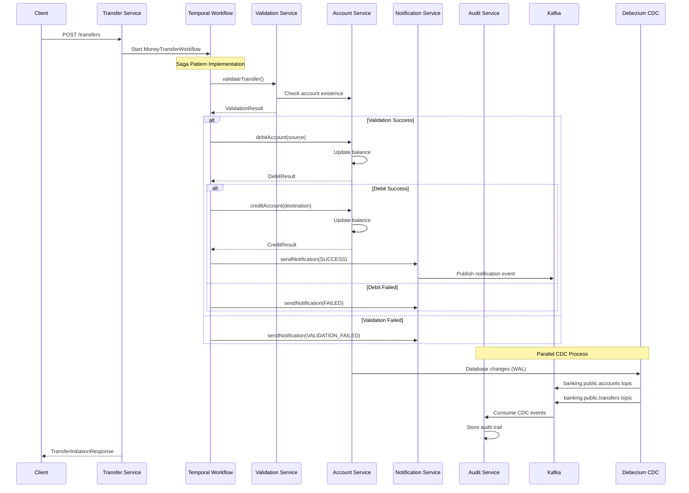

# Banking Demo with Temporal.io

Sistema bancário completo demonstrando o uso do Temporal.io para orquestração de transferências monetárias com arquitetura de microserviços, implementando padrões de saga distribuída, CDC (Change Data Capture) e auditoria completa em tempo real.

## 🏗️ Arquitetura do Sistema

### Microserviços

| Serviço | Porta | Responsabilidade | Tecnologias |
|---------|-------|------------------|-------------|
| **Account Service** | 8081 | Gerenciamento de contas bancárias, operações de saldo e persistência | Spring Boot, JPA, PostgreSQL |
| **Transfer Service** | 8082 | Orquestração de transferências usando workflows Temporal, coordenação de saga | Temporal SDK, Spring Boot, Kafka |
| **Validation Service** | 8087 | Validação de transferências, detecção de fraudes e regras de negócio | Spring Boot, OpenFeign |
| **Notification Service** | 8086 | Notificações de status via eventos Kafka, comunicação assíncrona | Spring Kafka, Spring Boot |
| **Audit Service** | 8085 | Trilha de auditoria completa via CDC, rastreabilidade de eventos | Debezium, Kafka Consumer, PostgreSQL |

### Infraestrutura

| Componente | Porta | Descrição | Configuração |
|------------|-------|-----------|--------------|
| **PostgreSQL (Main)** | 5432 | Banco principal (banking_demo) com WAL habilitado | Logical replication, publicações CDC |
| **PostgreSQL (Audit)** | 5433 | Banco de auditoria (audit_db) para eventos | Armazenamento JSONB otimizado |
| **Temporal Server** | 7233 | Motor de workflows distribuídos | OpenSearch backend, namespace padrão |
| **Temporal UI** | 8088 | Interface web do Temporal para monitoramento | Dashboard de workflows e execuções |
| **Kafka** | 9092 | Message broker para eventos CDC e notificações | Configuração single-node |
| **Kafka UI** | 8090 | Interface web do Kafka para debug | Visualização de tópicos e mensagens |
| **Debezium Connect** | 8083 | CDC connector para captura de mudanças | Conector PostgreSQL configurado |
| **Zookeeper** | 2181 | Coordenação do cluster Kafka | Configuração básica |
| **OpenSearch** | 9200 | Backend de persistência para Temporal | Substituindo Elasticsearch |

## 🚀 Instalação e Configuração

### Pré-requisitos

- **Java 21+** (testado com OpenJDK 21)
- **Maven 3.8+** (ou usar ./mvnw incluído)
- **Docker & Docker Compose** (versão 20.10+)
- **Git**
- **Make** (opcional, mas altamente recomendado)
- **curl** e **jq** (para scripts de teste)

### ⚡ Setup Rápido com Makefile

```bash
# Clone o repositório
git clone <repository-url>
cd banking-demo

# Setup completo em um comando (primeira vez)
make setup

# Para desenvolvimento ativo (inicia todos os serviços)
make -f Makefile.dev dev-setup
make -f Makefile.dev dev-start

# Verificar se tudo está funcionando
make debug-all
```

### 🎯 Setup Alternativo para Desenvolvimento

```bash
# Setup completo com reinicialização e teste
make -f Makefile.dev dev-restart-all

# Ou setup manual passo a passo
make setup-infra          # Infraestrutura Docker
make setup-cdc            # Configuração CDC
make build-all            # Compilação
make -f Makefile.dev dev-start  # Iniciar serviços
```

### 📋 Comandos Principais

```bash
# Ver todos os comandos disponíveis
make help

# 📦 Setup e Inicialização
make setup              # Setup completo (primeira vez)
make setup-infra        # Apenas infraestrutura Docker
make setup-cdc          # Apenas configuração CDC
make check-infra        # Verificar infraestrutura

# 🔨 Build e Execução
make build-all          # Compila todos os serviços
make build-service SERVICE=account-service  # Compila serviço específico
make run-service SERVICE=account-service    # Executa um serviço

# 🧪 Testes
make test-all           # Todos os testes unitários
make test-transfer      # Teste de transferência end-to-end
make test-cdc           # Teste do CDC completo
make test-cdc-data      # Teste com dados específicos

# 🔍 Debug e Diagnóstico
make debug-all          # Diagnóstico completo do sistema
make debug-cdc          # Debug específico do CDC
make debug-temporal     # Debug do Temporal
make debug-services     # Status dos microserviços
make debug-kafka-live   # Monitor Kafka em tempo real

# 🛠️ Correções e Reset
make restart-all        # Reinicia toda infraestrutura
make reset-cdc          # Reset completo do CDC
make reset-temporal     # Reset workflows Temporal
make reset-audit-consumer  # Reset consumer de auditoria
make fix-audit-db       # Corrige tabela de auditoria

# 🧹 Limpeza
make clean              # Limpeza completa
make stop               # Para todos os serviços
make stop-services      # Para apenas microserviços
make force-clean        # Limpeza forçada (cuidado!)

# 🌐 Utilitários
make urls               # Mostra URLs úteis
make check-orphans      # Verifica containers órfãos
```

### 🛠️ Desenvolvimento com Makefile.dev

```bash
# 🚀 Setup e Controle de Serviços
make -f Makefile.dev dev-setup           # Setup de desenvolvimento
make -f Makefile.dev dev-restart-all     # Reinicialização completa
make -f Makefile.dev dev-start           # Inicia todos em background
make -f Makefile.dev dev-stop            # Para todos os serviços
make -f Makefile.dev dev-restart SERVICE=account-service  # Reinicia específico

# 📋 Logs e Monitoramento
make -f Makefile.dev dev-logs SERVICE=account-service     # Logs específicos
make -f Makefile.dev dev-logs-all        # Logs de todos
make -f Makefile.dev dev-tail-logs       # Acompanha logs em tempo real
make -f Makefile.dev dev-health-check    # Verificação de saúde completa
make -f Makefile.dev dev-check-errors    # Procura erros nos logs

# 🧪 Testes de Desenvolvimento
make -f Makefile.dev dev-test-flow       # Teste completo do fluxo
make -f Makefile.dev dev-test-cdc-only   # Teste apenas CDC
make -f Makefile.dev dev-test-temporal   # Teste apenas Temporal

# 🔍 Debug Avançado
make -f Makefile.dev dev-debug-kafka     # Monitor Kafka em tempo real
make -f Makefile.dev dev-debug-db        # Consulta dados dos bancos

# 🧹 Utilitários
make -f Makefile.dev dev-clean-logs      # Limpa logs
make -f Makefile.dev dev-reset-data      # Remove dados de teste
```

> 💡 **Dica**: Use `make -f Makefile.dev dev-restart-all` para um ambiente completamente limpo e funcional.

### 🔧 Setup Manual (sem Makefile)

<details>
<summary>Clique para ver instruções manuais</summary>

#### 1. Inicie a Infraestrutura

```bash
docker-compose -f docker-compose.yml up -d
```

#### 2. Configure o CDC

```bash
# Aguarde 30 segundos para os serviços iniciarem
sleep 30

# Configure publicação PostgreSQL
docker exec banking-postgres psql -U postgres -d banking_demo -c "
CREATE PUBLICATION dbz_publication FOR TABLE public.accounts, public.transfers;"

# Registre conector Debezium
curl -X POST http://localhost:8083/connectors -H "Content-Type: application/json" -d '{
  "name": "banking-connector",
  "config": {
    "connector.class": "io.debezium.connector.postgresql.PostgresConnector",
    "database.hostname": "postgres",
    "database.port": "5432",
    "database.user": "postgres",
    "database.password": "postgres",
    "database.dbname": "banking_demo",
    "topic.prefix": "banking",
    "table.include.list": "public.accounts,public.transfers",
    "plugin.name": "pgoutput",
    "publication.name": "dbz_publication",
    "slot.name": "dbz_slot",
    "key.converter": "org.apache.kafka.connect.json.JsonConverter",
    "value.converter": "org.apache.kafka.connect.json.JsonConverter",
    "key.converter.schemas.enable": "false",
    "value.converter.schemas.enable": "false",
    "snapshot.mode": "initial"
  }
}'
```

#### 3. Compile e Execute

```bash
# Compile
./mvnw clean package -DskipTests

# Execute cada serviço em terminal separado
java -jar account-service/target/account-service-1.0-SNAPSHOT.jar
java -jar transfer-service/target/transfer-service-1.0-SNAPSHOT.jar
java -jar validation-service/target/validation-service-1.0-SNAPSHOT.jar
java -jar notification-service/target/notification-service-1.0-SNAPSHOT.jar
java -jar audit-service/target/audit-service-1.0-SNAPSHOT.jar
```

</details>

## 🔧 Verificação da Instalação

### Verificar Serviços

```bash
# Diagnóstico completo do CDC
./scripts/diagnose-cdc.sh

# Teste completo do sistema
./scripts/test-audit-cdc.sh
```

### Health Checks

```bash
# Verificar todos os serviços
curl http://localhost:8081/actuator/health  # Account Service
curl http://localhost:8082/actuator/health  # Transfer Service
curl http://localhost:8087/actuator/health  # Validation Service
curl http://localhost:8086/actuator/health  # Notification Service
curl http://localhost:8085/actuator/health  # Audit Service
```

### Interfaces Web

- **Temporal UI**: http://localhost:8088
- **Kafka UI**: http://localhost:8090

## 📋 Uso da API

### 1. Criar Contas

```bash
# Conta origem
curl -X POST http://localhost:8081/api/accounts \
  -H "Content-Type: application/json" \
  -d '{
    "accountNumber": "123456",
    "ownerName": "João Silva",
    "balance": 1000.00,
    "currency": "BRL"
  }'

# Conta destino
curl -X POST http://localhost:8081/api/accounts \
  -H "Content-Type: application/json" \
  -d '{
    "accountNumber": "789012",
    "ownerName": "Maria Santos",
    "balance": 500.00,
    "currency": "BRL"
  }'

# Consultar conta
curl http://localhost:8081/api/accounts/123456
```

### 2. Realizar Transferência

```bash
# Transferência básica
curl -X POST http://localhost:8082/api/transfers \
  -H "Content-Type: application/json" \
  -d '{
    "sourceAccountNumber": "123456",
    "destinationAccountNumber": "789012",
    "amount": 100.00,
    "currency": "BRL"
  }'

# Resposta esperada:
# {
#   "workflowId": "transfer-123",
#   "transferId": 123,
#   "status": "INITIATED",
#   "message": "Transfer initiated successfully"
# }
```

### 3. Consultar Status da Transferência

```bash
# Por workflow ID (recomendado)
curl http://localhost:8082/api/transfers/workflow/transfer-123

# Por transfer ID
curl http://localhost:8082/api/transfers/123/status

# Por transfer ID direto
curl http://localhost:8082/api/transfers/transfer/123

# Transferências por conta
curl http://localhost:8082/api/transfers/account/123456
```

### 4. Consultar Trilha de Auditoria

```bash
# Auditoria de uma conta específica
curl http://localhost:8085/api/audit/accounts/123456

# Busca por tipo de evento e período
curl "http://localhost:8085/api/audit/search?entityType=accounts&eventTypes=ACCOUNTS_CREATED,ACCOUNTS_UPDATED&start=2024-01-01T00:00:00&end=2024-12-31T23:59:59"

# Todos os eventos de auditoria (últimos)
curl http://localhost:8085/api/audit/events
```

### 5. Health Checks e Monitoramento

```bash
# Verificar saúde de todos os serviços
curl http://localhost:8081/actuator/health  # Account Service
curl http://localhost:8082/actuator/health  # Transfer Service
curl http://localhost:8087/actuator/health  # Validation Service
curl http://localhost:8086/actuator/health  # Notification Service
curl http://localhost:8085/actuator/health  # Audit Service

# Métricas detalhadas
curl http://localhost:8081/actuator/metrics
curl http://localhost:8081/actuator/info
```

### 6. Teste Automatizado Completo

```bash
# Use os scripts incluídos para teste completo
./scripts/test-audit-cdc.sh      # Teste CDC completo
./scripts/test-transfer.sh       # Teste de transferência
make test-cdc-data              # Teste com dados específicos
make -f Makefile.dev dev-test-flow  # Teste de desenvolvimento
```

## 🏛️ Arquitetura Técnica

### Fluxo de Transferência Detalhado



### Arquitetura de Change Data Capture (CDC)

```
┌─────────────────┐    WAL/Logical     ┌─────────────────┐
│ PostgreSQL      │    Replication     │ Debezium        │
│ (banking_demo)  │ ──────────────────▶│ Connect         │
│                 │                    │                 │
│ • accounts      │                    │ • PostgreSQL    │
│ • transfers     │                    │   Connector     │
└─────────────────┘                    │ • JSON Format   │
                                       └─────────────────┘
                                                │
                                                ▼
┌─────────────────┐                    ┌─────────────────┐
│ Audit Service   │◀───────────────────│ Kafka Topics    │
│                 │   Kafka Consumer   │                 │
│ • Event         │                    │ • banking.      │
│   Processing    │                    │   public.       │
│ • JSONB Storage │                    │   accounts      │
│ • REST API      │                    │ • banking.      │
└─────────────────┘                    │   public.       │
         │                             │   transfers     │
         ▼                             └─────────────────┘
┌─────────────────┐
│ PostgreSQL      │
│ (audit_db)      │
│                 │
│ • audit_events  │
│   (JSONB)       │
└─────────────────┘
```

### Padrões Arquiteturais Implementados

#### 1. **Saga Pattern (Orquestrada)**
- **Coordenador**: Temporal Workflow
- **Compensação**: Rollback automático em caso de falha
- **Estado**: Persistido no Temporal Server
- **Retry**: Configurável por atividade

#### 2. **Event Sourcing via CDC**
- **Captura**: Debezium monitora WAL do PostgreSQL
- **Eventos**: Todas as mudanças são capturadas
- **Auditoria**: Trilha completa e imutável
- **Replay**: Possível reconstruir estado

#### 3. **CQRS (Command Query Responsibility Segregation)**
- **Commands**: Transfer Service (escrita)
- **Queries**: Audit Service (leitura)
- **Separação**: Bancos diferentes para operação e auditoria

#### 4. **Circuit Breaker & Retry**
- **Temporal**: Retry automático configurável
- **Timeout**: Por atividade
- **Fallback**: Compensação em caso de falha

## 🛠️ Stack Tecnológico

### Core Technologies
- **Java 21** - Linguagem principal com features modernas
- **Spring Boot 3.2.3** - Framework de aplicação e microserviços
- **Temporal.io 1.24.1** - Orquestração de workflows distribuídos
- **PostgreSQL 15** - Banco de dados relacional com suporte a JSONB
- **Apache Kafka 7.4.0** - Message streaming e event sourcing
- **Debezium 2.5.0.Final** - Change Data Capture em tempo real

### Infrastructure & DevOps
- **Docker & Docker Compose** - Containerização e orquestração local
- **OpenSearch 2.5.0** - Backend de persistência para Temporal (substitui Elasticsearch)
- **Maven** - Gerenciamento de dependências e build
- **Make** - Automação de tarefas e scripts

### Spring Ecosystem
- **Spring Data JPA** - Persistência e mapeamento objeto-relacional
- **Spring Kafka** - Integração com Apache Kafka
- **Spring Cloud OpenFeign** - Comunicação entre microserviços
- **Spring Boot Actuator** - Monitoramento e métricas

### Development & Testing
- **Lombok** - Redução de boilerplate code
- **TestContainers 1.19.6** - Testes de integração com containers
- **Temporal Testing SDK** - Testes de workflows
- **JUnit 5** - Framework de testes unitários

### Observability
- **Spring Boot Actuator** - Health checks e métricas
- **Temporal UI** - Dashboard de workflows
- **Kafka UI** - Interface para monitoramento de tópicos
- **Logs estruturados** - Para debug e monitoramento

### Database Features
- **PostgreSQL WAL** - Write-Ahead Logging para CDC
- **Logical Replication** - Captura de mudanças em tempo real
- **JSONB** - Armazenamento eficiente de eventos de auditoria
- **Publicações e Slots** - Configuração CDC otimizada

## 🧪 Estratégia de Testes

### Testes Unitários

```bash
# Todos os testes unitários
./mvnw test

# Testes de um módulo específico
./mvnw test -pl account-service
./mvnw test -pl transfer-service

# Testes com cobertura
./mvnw test jacoco:report
```

### Testes de Integração

```bash
# Teste completo do fluxo CDC
./scripts/test-audit-cdc.sh

# Teste de transferência end-to-end
./scripts/test-transfer.sh

# Testes automatizados via Makefile
make test-all              # Todos os testes
make test-cdc              # CDC específico
make test-cdc-data         # Dados específicos
make -f Makefile.dev dev-test-flow  # Fluxo completo
```

### Testes de Workflow Temporal

```bash
# Testes específicos de workflow
./mvnw test -Dtest=MoneyTransferWorkflowTest
./mvnw test -Dtest=*WorkflowTest

# Testes com Temporal Testing SDK
./mvnw test -pl transfer-service -Dtest=*TemporalTest
```

### Cenários de Teste Cobertos

#### ✅ Fluxos Principais
- **Transferências bem-sucedidas** - Fluxo completo sem erros
- **Criação de contas** - Validação de dados e persistência
- **Consultas de saldo** - Operações de leitura

#### ✅ Cenários de Erro
- **Falhas de validação** - Dados inválidos, regras de negócio
- **Saldo insuficiente** - Validação de fundos disponíveis
- **Contas inexistentes** - Tratamento de entidades não encontradas
- **Falhas de rede** - Timeout e indisponibilidade de serviços

#### ✅ Padrões Distribuídos
- **Compensação de transações** - Rollback via Saga Pattern
- **Retry automático** - Recuperação de falhas temporárias
- **Idempotência** - Operações seguras para retry
- **Consistência eventual** - Sincronização entre serviços

#### ✅ Auditoria e CDC
- **Captura de eventos** - Todas as mudanças são registradas
- **Integridade de dados** - Validação de eventos CDC
- **Rastreabilidade** - Trilha completa de operações
- **Performance CDC** - Latência e throughput

### Testes de Performance

```bash
# Teste de carga básico (requer ferramentas adicionais)
# curl -X POST http://localhost:8082/api/transfers (em loop)

# Monitoramento durante testes
make debug-all
make -f Makefile.dev dev-debug-kafka
```

### Testes de Resiliência

```bash
# Simular falhas de serviço
docker stop banking-postgres
make debug-all  # Verificar comportamento

# Simular falhas de rede
# (usar ferramentas como toxiproxy ou chaos engineering)
```

## 🔍 Monitoramento e Observabilidade

### Dashboards Web

| Interface | URL | Descrição | Funcionalidades |
|-----------|-----|-----------|-----------------|
| **Temporal UI** | http://localhost:8088 | Dashboard de workflows | Execuções, histórico, retry, debug |
| **Kafka UI** | http://localhost:8090 | Interface do Kafka | Tópicos, mensagens, consumers, lag |
| **Debezium API** | http://localhost:8083 | API do Debezium Connect | Status conectores, configuração, tasks |

### Endpoints de Monitoramento

```bash
# Health Checks detalhados
curl http://localhost:8081/actuator/health | jq .  # Account Service
curl http://localhost:8082/actuator/health | jq .  # Transfer Service
curl http://localhost:8085/actuator/health | jq .  # Audit Service
curl http://localhost:8086/actuator/health | jq .  # Notification Service
curl http://localhost:8087/actuator/health | jq .  # Validation Service

# Métricas específicas
curl http://localhost:8081/actuator/metrics/jvm.memory.used
curl http://localhost:8082/actuator/metrics/temporal.workflow.completed
curl http://localhost:8085/actuator/metrics/kafka.consumer.records.consumed.total

# Informações da aplicação
curl http://localhost:8081/actuator/info | jq .
```

### Logs Estruturados

```bash
# Logs da infraestrutura
docker logs banking-postgres           # PostgreSQL principal
docker logs banking-audit-postgres     # PostgreSQL auditoria
docker logs banking-kafka             # Kafka broker
docker logs banking-debezium-connect  # CDC connector
docker logs banking-temporal          # Temporal server

# Logs dos microserviços (quando usando dev-start)
tail -f logs/account-service.log      # Account Service
tail -f logs/transfer-service.log     # Transfer Service
tail -f logs/audit-service.log        # Audit Service
tail -f logs/notification-service.log # Notification Service
tail -f logs/validation-service.log   # Validation Service

# Todos os logs em tempo real
make -f Makefile.dev dev-tail-logs
```

### Comandos de Diagnóstico

```bash
# Diagnóstico completo automatizado
make debug-all

# Diagnósticos específicos
make debug-cdc          # Status CDC detalhado
make debug-temporal     # Workflows ativos
make debug-services     # Status microserviços
make debug-kafka-live   # Monitor Kafka tempo real

# Verificação de saúde para desenvolvimento
make -f Makefile.dev dev-health-check
make -f Makefile.dev dev-check-errors
```

### Métricas Importantes

#### Temporal Workflows
- **Execuções ativas**: Workflows em andamento
- **Taxa de sucesso**: Percentual de workflows completados
- **Tempo médio**: Duração das transferências
- **Retry count**: Número de tentativas

#### Kafka & CDC
- **Lag do consumer**: Atraso no processamento de eventos
- **Throughput**: Mensagens por segundo
- **Offset position**: Posição atual do consumer
- **Connector status**: Estado dos conectores Debezium

#### Microserviços
- **Response time**: Tempo de resposta das APIs
- **Error rate**: Taxa de erros HTTP
- **JVM metrics**: Memória, GC, threads
- **Database connections**: Pool de conexões

### Alertas e Troubleshooting

```bash
# Verificar problemas comuns
make -f Makefile.dev dev-check-errors  # Erros nos logs
make check-orphans                     # Containers órfãos
make debug-cdc                         # Problemas CDC

# Scripts de diagnóstico específicos
./scripts/diagnose-cdc.sh             # Diagnóstico CDC visual
./scripts/diagnose-temporal.sh        # Diagnóstico Temporal
```

## 🚨 Troubleshooting

### Problemas Comuns e Soluções

#### 🔗 CDC não está funcionando
```bash
# 1. Verificar status do conector
curl http://localhost:8083/connectors/banking-connector/status | jq .

# 2. Verificar configuração PostgreSQL
docker exec banking-postgres psql -U postgres -d banking_demo -c "
SELECT * FROM pg_publication WHERE pubname = 'dbz_publication';
SELECT slot_name, plugin, slot_type, database, active FROM pg_replication_slots;"

# 3. Reset completo do CDC
make reset-cdc

# 4. Diagnóstico visual
make debug-cdc
./scripts/diagnose-cdc.sh
```

#### 🔄 Loop infinito de deserialização no audit-service
```bash
# 1. Verificar formato das mensagens Kafka
docker exec banking-kafka kafka-console-consumer \
  --bootstrap-server localhost:9092 \
  --topic banking.public.accounts \
  --from-beginning --max-messages 1

# 2. Reset do consumer
make reset-audit-consumer

# 3. Corrigir tabela de auditoria
make fix-audit-db

# 4. Recompilar e reiniciar
make build-service SERVICE=audit-service
make -f Makefile.dev dev-restart SERVICE=audit-service
```

#### 🗄️ Erro de tipo JSONB no banco de dados
```bash
# 1. Verificar estrutura da tabela
docker exec banking-audit-postgres psql -U postgres -d audit_db -c "\d audit_events"

# 2. Recriar tabela (Hibernate criará automaticamente)
make fix-audit-db

# 3. Verificar logs do audit-service
make -f Makefile.dev dev-logs SERVICE=audit-service

# 4. Teste manual de inserção JSONB
docker exec banking-audit-postgres psql -U postgres -d audit_db -c "
INSERT INTO audit_events (event_type, entity_type, entity_id, event_data, timestamp) 
VALUES ('TEST', 'accounts', 'TEST123', '{\"test\": \"data\"}'::jsonb, NOW());"
```

#### 🌐 Serviços não conseguem se conectar
```bash
# 1. Verificar rede Docker
docker network ls | grep banking
docker network inspect banking-network

# 2. Verificar containers ativos
docker ps --format "table {{.Names}}\t{{.Status}}" | grep banking

# 3. Reiniciar infraestrutura completa
make restart-all

# 4. Verificar conectividade entre serviços
docker exec banking-postgres pg_isready -U postgres
docker exec banking-kafka kafka-topics --bootstrap-server localhost:9092 --list
```

#### ⚡ Temporal workflows não executam
```bash
# 1. Verificar Temporal Server
curl http://localhost:7233/api/v1/namespaces | jq .

# 2. Verificar workflows ativos
curl "http://localhost:7233/api/v1/namespaces/default/workflows" | jq .

# 3. Verificar logs do Temporal
docker logs banking-temporal | tail -50

# 4. Reset workflows se necessário
make reset-temporal

# 5. Verificar configuração do transfer-service
make -f Makefile.dev dev-logs SERVICE=transfer-service | grep -i temporal
```

#### 🚀 Microserviços não iniciam
```bash
# 1. Verificar se a compilação foi bem-sucedida
make build-all

# 2. Verificar dependências (PostgreSQL deve estar rodando)
make check-infra

# 3. Verificar logs de inicialização
make -f Makefile.dev dev-logs SERVICE=account-service

# 4. Verificar portas em uso
netstat -tulpn | grep -E ":(8081|8082|8085|8086|8087)"

# 5. Iniciar serviços individualmente para debug
java -jar account-service/target/account-service-1.0-SNAPSHOT.jar
```

### Scripts de Diagnóstico Avançado

```bash
# Diagnóstico completo visual
./scripts/diagnose-cdc.sh

# Verificação de saúde completa
make -f Makefile.dev dev-health-check

# Procurar erros específicos
make -f Makefile.dev dev-check-errors

# Monitoramento em tempo real
make debug-kafka-live  # Kafka messages
make -f Makefile.dev dev-tail-logs  # All service logs
```

### Comandos de Recuperação Rápida

```bash
# Reset completo do ambiente (cuidado!)
make force-clean
make restart-all

# Reset apenas CDC
make reset-cdc

# Reset apenas dados de teste
make -f Makefile.dev dev-reset-data

# Reinicialização completa para desenvolvimento
make -f Makefile.dev dev-restart-all
```

### Verificações Manuais Avançadas

```bash
# Verificar configuração PostgreSQL WAL
docker exec banking-postgres psql -U postgres -d banking_demo -c "
SHOW wal_level;
SHOW max_replication_slots;
SHOW max_wal_senders;"

# Verificar tópicos Kafka e mensagens
docker exec banking-kafka kafka-topics --bootstrap-server localhost:9092 --describe --topic banking.public.accounts

# Verificar consumer groups
docker exec banking-kafka kafka-consumer-groups --bootstrap-server localhost:9092 --list
docker exec banking-kafka kafka-consumer-groups --bootstrap-server localhost:9092 --describe --group audit-service

# Verificar dados nas tabelas
docker exec banking-postgres psql -U postgres -d banking_demo -c "SELECT COUNT(*) FROM accounts;"
docker exec banking-audit-postgres psql -U postgres -d audit_db -c "SELECT COUNT(*) FROM audit_events;"
```

## 🎯 Funcionalidades Principais

### 💰 Sistema de Contas
- **Criação de contas** com validação de dados
- **Consulta de saldo** em tempo real
- **Histórico de transações** por conta
- **Suporte a múltiplas moedas** (BRL, USD, EUR)
- **Validação de integridade** de dados

### 🔄 Sistema de Transferências
- **Transferências seguras** entre contas
- **Validação de fundos** antes da execução
- **Saga Pattern** para consistência distribuída
- **Retry automático** em caso de falhas temporárias
- **Compensação automática** em caso de erro
- **Rastreamento completo** via workflow ID

### 🔍 Sistema de Auditoria
- **Trilha completa** de todas as operações
- **Captura em tempo real** via CDC
- **Armazenamento imutável** de eventos
- **API de consulta** flexível por período/tipo
- **Rastreabilidade** de mudanças de estado

### ⚡ Orquestração com Temporal
- **Workflows duráveis** que sobrevivem a falhas
- **Estado persistente** automático
- **Retry configurável** por atividade
- **Timeout management** inteligente
- **Visibilidade completa** via UI

### 📊 Monitoramento e Observabilidade
- **Health checks** detalhados
- **Métricas de performance** via Actuator
- **Logs estruturados** para debug
- **Dashboards visuais** para Kafka e Temporal
- **Diagnóstico automatizado** via scripts

## 🚀 Casos de Uso Demonstrados

### 1. Transferência Bancária Simples
```bash
# Criar contas
curl -X POST http://localhost:8081/api/accounts -H "Content-Type: application/json" \
  -d '{"accountNumber": "001", "ownerName": "Alice", "balance": 1000.00, "currency": "BRL"}'

curl -X POST http://localhost:8081/api/accounts -H "Content-Type: application/json" \
  -d '{"accountNumber": "002", "ownerName": "Bob", "balance": 500.00, "currency": "BRL"}'

# Executar transferência
curl -X POST http://localhost:8082/api/transfers -H "Content-Type: application/json" \
  -d '{"sourceAccountNumber": "001", "destinationAccountNumber": "002", "amount": 100.00, "currency": "BRL"}'
```

### 2. Auditoria e Rastreabilidade
```bash
# Consultar trilha de auditoria
curl http://localhost:8085/api/audit/accounts/001

# Buscar eventos por período
curl "http://localhost:8085/api/audit/search?entityType=accounts&start=2024-01-01T00:00:00&end=2024-12-31T23:59:59"
```

### 3. Monitoramento de Workflows
- Acesse http://localhost:8088 para ver workflows em execução
- Monitore retry automático e compensação
- Visualize histórico completo de execuções

### 4. Análise de Eventos CDC
- Acesse http://localhost:8090 para ver mensagens Kafka
- Monitore tópicos `banking.public.accounts` e `banking.public.transfers`
- Observe latência entre mudança e auditoria

## 🤝 Contribuição

### Como Contribuir

1. **Fork** o projeto
2. **Clone** seu fork: `git clone <your-fork-url>`
3. **Crie uma branch** para sua feature: `git checkout -b feature/AmazingFeature`
4. **Configure o ambiente**: `make setup`
5. **Desenvolva** sua funcionalidade
6. **Teste** suas mudanças: `make test-all`
7. **Commit** suas mudanças: `git commit -m 'Add some AmazingFeature'`
8. **Push** para a branch: `git push origin feature/AmazingFeature`
9. **Abra um Pull Request**

### Padrões de Desenvolvimento

#### Estrutura de Commits
```
feat: adiciona nova funcionalidade de validação
fix: corrige problema de deserialização CDC
docs: atualiza documentação da API
test: adiciona testes para transfer service
refactor: melhora estrutura do audit service
```

#### Testes Obrigatórios
- **Testes unitários** para nova funcionalidade
- **Testes de integração** se aplicável
- **Verificação CDC** se mudanças no modelo
- **Teste end-to-end** para fluxos principais

#### Code Review Checklist
- [ ] Código segue padrões do projeto
- [ ] Testes passam: `make test-all`
- [ ] Documentação atualizada
- [ ] CDC funciona: `make test-cdc`
- [ ] Sem quebras: `make debug-all`

## 📈 Performance e Escalabilidade

### Métricas de Performance Atuais
- **Latência de transferência**: ~200-500ms (end-to-end)
- **Throughput CDC**: ~1000 eventos/segundo
- **Latência de auditoria**: ~50-100ms (após CDC)
- **Temporal workflows**: Suporte a milhares de execuções simultâneas

### Otimizações Implementadas
- **Connection pooling** para PostgreSQL
- **Batch processing** no audit-service
- **Índices otimizados** para consultas de auditoria
- **Kafka partitioning** para paralelização
- **Temporal worker scaling** configurável

### Limites Conhecidos
- **Single-node Kafka**: Para produção, usar cluster
- **PostgreSQL único**: Considerar read replicas
- **Sem cache distribuído**: Redis/Hazelcast para alta escala
- **Monitoramento básico**: APM profissional recomendado

## 🔮 Roadmap e Próximos Passos

### 🎯 Versão 2.0 (Planejada)
- [ ] **Autenticação e Autorização** (OAuth2/JWT)
- [ ] **Rate Limiting** por cliente
- [ ] **Cache distribuído** (Redis)
- [ ] **Métricas avançadas** (Prometheus/Grafana)
- [ ] **Testes de carga** automatizados

### 🚀 Melhorias de Produção
- [ ] **Kubernetes deployment** (Helm charts)
- [ ] **CI/CD pipeline** completo
- [ ] **Backup automatizado** dos bancos
- [ ] **Disaster recovery** procedures
- [ ] **Security scanning** automatizado

### 🔧 Melhorias Técnicas
- [ ] **Event sourcing completo** (além do CDC)
- [ ] **CQRS avançado** com projeções
- [ ] **Distributed tracing** (Jaeger/Zipkin)
- [ ] **Schema evolution** para Kafka
- [ ] **Multi-tenancy** support

### 📚 Documentação
- [ ] **API documentation** (OpenAPI/Swagger)
- [ ] **Architecture Decision Records** (ADRs)
- [ ] **Runbooks** operacionais
- [ ] **Performance benchmarks**
- [ ] **Security guidelines**

## 📚 Recursos Adicionais

### Documentação Técnica
- [MAKEFILE_GUIDE.md](MAKEFILE_GUIDE.md) - Guia completo dos comandos Make
- [CHANGELOG.md](CHANGELOG.md) - Histórico de mudanças
- [CONTRIBUTING.md](CONTRIBUTING.md) - Guia de contribuição
- [request.http](request.http) - Exemplos de API

### Scripts Úteis
- `scripts/diagnose-cdc.sh` - Diagnóstico visual do CDC
- `scripts/test-audit-cdc.sh` - Teste completo do sistema
- `scripts/setup/start-banking-demo.sh` - Inicialização automatizada

### Referências Externas
- [Temporal.io Documentation](https://docs.temporal.io/)
- [Debezium Documentation](https://debezium.io/documentation/)
- [Spring Boot Reference](https://docs.spring.io/spring-boot/docs/current/reference/html/)
- [Apache Kafka Documentation](https://kafka.apache.org/documentation/)

## 📄 Licença

Este projeto está sob a licença MIT. Veja o arquivo `LICENSE` para mais detalhes.

## 🆘 Suporte

### Para Dúvidas e Problemas
1. **Consulte primeiro**: README.md e MAKEFILE_GUIDE.md
2. **Execute diagnóstico**: `make debug-all`
3. **Verifique logs**: `make -f Makefile.dev dev-check-errors`
4. **Abra uma issue** no GitHub com:
   - Descrição do problema
   - Logs relevantes
   - Passos para reproduzir
   - Output do `make debug-all`

### Recursos de Ajuda
- **Issues do GitHub**: Para bugs e feature requests
- **Documentação oficial**: Links nas referências acima
- **Scripts de diagnóstico**: Incluídos no projeto
- **Logs detalhados**: Via Makefile.dev

### Comunidade
- Contribuições são bem-vindas!
- Siga os padrões de contribuição
- Participe das discussões via issues
- Compartilhe casos de uso interessantes

---

**Desenvolvido com ❤️ usando Temporal.io, Spring Boot e tecnologias modernas de microserviços.**